# V1 方法框架图

```mermaid
flowchart LR
    %% ===================== Text branch =====================
    subgraph BASE["(a) AA-CLIP 基础模块"]
        direction TB
        NP["正常文本提示"]:::cInput
        AP["异常文本提示"]:::cInput
        TE["冻结的 CLIP 文本编码器"]:::cFrozen
        TA["Text Adapter"]:::cTrainable
        ANCHOR["正常/异常文本锚点<br/>t_n, t_a"]:::cAnchor

        NP --> TE
        AP --> TE
        TE --> TA --> ANCHOR
    end

    %% ===================== Dual-view encoding =====================
    subgraph DUAL["(b) 模态噪声双视图编码"]
        direction TB
        IMG["原始医学图像 I"]:::cInput
        NOISE["模态相关强度扰动 T_m<br/>MRI / CT / US / Retina / Endoscopy"]:::cNoise
        AUXIMG["空间对齐的辅助噪声视图 Ĩ"]:::cNoise

        PENC["冻结的 CLIP 图像编码器<br/>+ 可训练 Image Adapter"]:::cEncoder
        RENC["共享权重图像编码器<br/>No Gradient"]:::cEncoderNoGrad

        PF["主视图多尺度 Patch 特征<br/>P^(l), l∈{6,12,18,24}"]:::cFeature
        CLS["CLIP 最终全局特征<br/>C=LN(CLS_24)W_proj"]:::cAnchor
        RF["辅助视图多尺度 Patch 特征<br/>R^(l)"]:::cNoiseFeature

        IMG --> PENC --> PF
        PENC --> CLS
        IMG --> NOISE --> AUXIMG --> RENC --> RF
        PENC -.->|共享权重| RENC
    end

    %% ===================== Proposed graph =====================
    subgraph V1GRAPH["(c) V1：噪声感知病灶保持 Patch Graph"]
        direction TB

        FUSION["双视图特征融合<br/>G_i=(P_i+R_i)/2"]:::cGraph
        UNC["Patch 噪声不确定性<br/>u_i=(1-cos(P_i,R_i))/2"]:::cUncertainty
        APRIOR["文本引导异常先验<br/>a_i=Softmax(G_i·[t_n,t_a])_abnormal"]:::cLesion

        KNN["语义 Hard KNN 图"]:::cTopology
        SPA["空间八邻域图"]:::cTopology
        MIX["混合拓扑<br/>A=αA_KNN+(1-α)A_spatial"]:::cGraph

        AFF["连续特征亲和度<br/>exp((cos(G_i,G_j)-1)/τ_f)"]:::cGraphDetail
        REL["噪声源可靠性<br/>1-u_j"]:::cUncertainty
        BOUND["病灶边界亲和度<br/>exp(-|a_i-a_j|/τ_a)"]:::cLesion

        WEIGHT["可靠性加权邻接矩阵<br/>Ã_ij=A_ij × Feature × Reliability × Boundary"]:::cGraphStrong
        MSG["可靠邻居消息聚合<br/>z_i=LN(W·Σ_j Ã_ijG_j)"]:::cGraphStrong
        GATE["病灶保护更新门<br/>q_i=σ(s_u u_i-s_a a_i+b)"]:::cLesionStrong
        REFINE["精炼 Patch 特征<br/>F'_i=(1-q_i)G_i+q_i z_i"]:::cOutputFeature

        PF --> FUSION
        RF --> FUSION
        PF --> UNC
        RF --> UNC
        FUSION --> APRIOR

        KNN --> MIX
        SPA --> MIX
        FUSION --> KNN
        FUSION --> AFF
        UNC --> REL
        APRIOR --> BOUND

        MIX --> WEIGHT
        AFF --> WEIGHT
        REL --> WEIGHT
        BOUND --> WEIGHT
        FUSION --> MSG
        WEIGHT --> MSG

        UNC --> GATE
        APRIOR --> GATE
        FUSION --> REFINE
        MSG --> REFINE
        GATE --> REFINE
    end

    %% ===================== Prediction =====================
    subgraph PRED["(d) 多尺度医学异常预测"]
        direction TB
        SIM["F' 与文本锚点计算相似度"]:::cPrediction
        MAPS["多尺度异常图<br/>上采样并求和"]:::cPrediction
        HEAT["Pixel Anomaly Map  M(x,y)"]:::cHeatmap
        PMAX["局部图像分数<br/>S_pixel=max M(x,y)"]:::cPrediction
        DET["图检测特征<br/>Z_g=Mean(F'_det)"]:::cPrediction
        GFUSE["CLS—图全局融合<br/>Z_img=Norm(0.8Z_g+0.2C)"]:::cGraphStrong
        GSCORE["全局异常分数<br/>S_global"]:::cPrediction
        FINAL["医学图像评分<br/>S_image=0.8S_pixel+0.2S_global"]:::cImageScore

        REFINE --> SIM
        ANCHOR --> SIM
        SIM --> MAPS --> HEAT --> PMAX --> FINAL
        REFINE --> DET --> GFUSE --> GSCORE --> FINAL
        CLS --> GFUSE
        ANCHOR --> GSCORE
    end

    %% ===================== Training losses =====================
    subgraph LOSS["(e) 仅源域训练时使用的监督"]
        direction TB
        GT["病灶 Mask<br/>Training Only"]:::cMask
        LABEL["图像标签"]:::cMask
        LSEG["L_seg<br/>Focal + Dice"]:::cLoss
        LCONS["L_cons<br/>双视图预测一致性"]:::cLoss
        LPRES["L_pres<br/>病灶特征保持"]:::cLoss
        LBOUND["L_boundary<br/>病灶边界对比"]:::cLoss
        LCLS["L_cls<br/>图像分类"]:::cLoss
        LTOTAL["总目标<br/>L=L_cls+L_seg+λ_cL_cons+λ_pL_pres+λ_bL_boundary"]:::cTotalLoss

        GT -.-> LSEG
        GT -.-> LPRES
        GT -.-> LBOUND
        LABEL -.-> LCLS
        HEAT -.-> LSEG
        PF -.-> LCONS
        RF -.-> LCONS
        PF -.-> LPRES
        REFINE -.-> LPRES
        REFINE -.-> LBOUND
        GFUSE -.-> LCLS

        LSEG --> LTOTAL
        LCONS --> LTOTAL
        LPRES --> LTOTAL
        LBOUND --> LTOTAL
        LCLS --> LTOTAL
    end

    %% ===================== Styles =====================
    classDef cInput fill:#E8F1FB,stroke:#3973AC,stroke-width:1.5px,color:#102A43;
    classDef cFrozen fill:#E7E9EC,stroke:#6B7280,stroke-width:1.5px,color:#30343B;
    classDef cTrainable fill:#DDEBFF,stroke:#2563EB,stroke-width:2px,color:#173B72;
    classDef cAnchor fill:#D8F3EA,stroke:#138A72,stroke-width:2px,color:#075E54;
    classDef cEncoder fill:#DDEBFF,stroke:#2563EB,stroke-width:2px,color:#173B72;
    classDef cEncoderNoGrad fill:#FFF1DD,stroke:#D97706,stroke-width:2px,stroke-dasharray:5 4,color:#7C3F00;
    classDef cFeature fill:#E6F0FF,stroke:#3973AC,stroke-width:1.5px,color:#173B72;
    classDef cNoise fill:#FFF0DA,stroke:#E68A00,stroke-width:2px,color:#804600;
    classDef cNoiseFeature fill:#FFF0DA,stroke:#E68A00,stroke-width:1.5px,color:#804600;
    classDef cUncertainty fill:#FFE2B8,stroke:#D97706,stroke-width:2px,color:#7C3F00;
    classDef cTopology fill:#EEE8FF,stroke:#7C5CC4,stroke-width:1.5px,color:#3D2673;
    classDef cGraph fill:#E9DFFF,stroke:#7048B8,stroke-width:2px,color:#38206A;
    classDef cGraphDetail fill:#F2ECFF,stroke:#8B6AC8,stroke-width:1.5px,color:#3D2673;
    classDef cGraphStrong fill:#DFD0FF,stroke:#6135AE,stroke-width:2.5px,color:#31145F;
    classDef cLesion fill:#FFE0E0,stroke:#D64545,stroke-width:2px,color:#7F1D1D;
    classDef cLesionStrong fill:#FFCACA,stroke:#C62828,stroke-width:2.5px,color:#711515;
    classDef cOutputFeature fill:#DDF5E5,stroke:#238B57,stroke-width:2.5px,color:#115B35;
    classDef cPrediction fill:#DDF5E5,stroke:#238B57,stroke-width:2px,color:#115B35;
    classDef cHeatmap fill:#CBEFD8,stroke:#16834B,stroke-width:2.5px,color:#0B522D;
    classDef cImageScore fill:#B8E8C9,stroke:#08783D,stroke-width:3px,color:#06472A;
    classDef cAuxiliary fill:#F3F4F6,stroke:#6B7280,stroke-width:1.5px,stroke-dasharray:5 4,color:#374151;
    classDef cMask fill:#FFF6BF,stroke:#B68B00,stroke-width:1.5px,stroke-dasharray:5 4,color:#674D00;
    classDef cLoss fill:#FFF2C7,stroke:#C28B00,stroke-width:1.5px,color:#6B4C00;
    classDef cTotalLoss fill:#FFE49A,stroke:#A96E00,stroke-width:2.5px,color:#5A3900;
```

## 图例建议

- 灰色：冻结的 CLIP 模块。
- 蓝色：AA-CLIP 的可训练 Adapter 和主视图特征。
- 橙色：辅助噪声视图与不确定性。
- 紫色：V1 的图结构与消息传播。
- 红色：异常先验、病灶边界和病灶保护门控。
- 绿色：精炼特征与最终预测。
- 黄色虚线：只在源域训练时使用的标签和 Mask，不参与目标域推理。
- 虚线编码器：共享参数但无梯度的辅助视图分支。

## 推荐图注

> **Overview of the proposed V1 framework.** A modality-aware intensity
> perturbation generates a spatially aligned auxiliary view to estimate patch
> uncertainty. The noise-aware lesion-preserving graph propagates reliable
> contextual information while suppressing messages from uncertain patches
> and reducing updates at likely lesions. Ground-truth masks are used only for
> source-domain training constraints and are not required during inference.

建议先在支持 Mermaid 的 Markdown 预览器中检查结构，再导出为 SVG，在
draw.io、Inkscape 或 PowerPoint 中进行论文级排版与字体统一。
