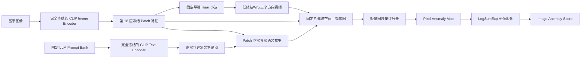

# V3：冻结编码器空间—频率一致性图

## 1. 方法定位

V3 是与 V1 独立的实验分支。V1 通过 Text/Image Adapter、双噪声视图和病灶保持
Patch Graph 适配 CLIP；V3 则完全冻结 CLIP 图像与文本 Encoder，只在 Encoder 输出
之后训练一个约 2.6 万参数的空间—频率图残差头。

当前数据是二维静态医学图像，因此论文中应称为**空间—频率变换**，不能称为
时间—频率变换。只有使用连续超声帧、时间序列或有序体数据切片时，才存在真实的
时间或切片维度。

## 2. 与近期工作的关系

- [Q-Former Autoencoder](https://arxiv.org/abs/2507.18481) 表明冻结视觉基础模型可用于
  医学异常检测；V3 不使用其 Q-Former 与重建 Decoder。
- [VisualAD](https://arxiv.org/abs/2603.07952) 使用冻结 ViT 和视觉异常 Token；V3 不向
  Encoder 内插入 Token，也不使用 SCA/SAF。
- [FE-CLIP](https://openaccess.thecvf.com/content/ICCV2025/html/Gong_FE-CLIP_Frequency_Enhanced_CLIP_Model_for_Zero-Shot_Anomaly_Detection_and_ICCV_2025_paper.html)
  使用 DCT 频率 Adapter；V3 不修改 Encoder，而是在冻结特征之后使用固定平稳小波。
- [Wave-MambaAD](https://openaccess.thecvf.com/content/ICCV2025/html/Zhang_Wave-MambaAD_Wavelet-driven_State_Space_Model_for_Multi-class_Unsupervised_Anomaly_Detection_ICCV_2025_paper.html)
  分别建模高低频；V3 不使用 Mamba 或重建，而是建模医学 patch 的空间—频率一致性。
- [CLAP](https://arxiv.org/abs/2411.07546) 说明正常/异常对比有助于减少医学误报；V3
  使用固定 LLM 描述集和冻结 CLIP Text Encoder，不训练 Prompt 或 Text Adapter。

这些论文只构成设计动机。V3 的具体组合是：**冻结 CLIP 特征、固定平稳小波、局部
空间—频率图、正常/异常语义先验和频带干预一致性**。

## 3. 总体流程



## 4. 冻结特征与文本先验

给定图像 \(I\)，从冻结 CLIP 的指定中间层提取 patch token，并使用冻结的
`ln_post` 与视觉投影得到：

\[
F=E_{\mathrm{frozen}}^{(l)}(I),\qquad l=18.
\]

LLM Prompt Bank 中同一状态的多条文本经冻结 Text Encoder 编码、平均并归一化，
得到 \(t_n,t_a\)。Patch 异常概率和语义 margin 为：

\[
[z_{i,n},z_{i,a}]
=\tau F_i^\top[t_n,t_a],
\]

\[
a_i=\operatorname{Softmax}([z_{i,n},z_{i,a}])_a,
\qquad m_i=z_{i,a}-z_{i,n}.
\]

所有 CLIP 参数的 `requires_grad=False`，模型处于 `eval()` 状态。checkpoint 只保存
V3 Head，不复制 CLIP 权重。测试时会强制核对特征层、Head 维度、三个温度参数以及
图像级池化温度，避免训练和测试配置不一致却未被发现。

## 5. 固定空间—频率变换

将 patch token 恢复成二维网格，在每个特征通道执行不降采样的固定 Haar 分析：

\[
(F_{LL},F_{LH},F_{HL},F_{HH})=\mathcal W_{\mathrm{SWT}}(F).
\]

- `LL` 描述低频和局部结构；
- `LH/HL/HH` 描述三个方向的细节变化；
- 固定滤波器没有可训练参数；
- 不降低 patch 网格分辨率，避免普通 DWT 下采样损伤小病灶定位。

三个高频能量使用同一图像级尺度归一化，保留方向频带之间的相对能量，不能分别
标准化后把频带差异抵消。

## 6. 空间—频率一致性图

每个 patch 是一个节点，只连接固定八邻域。边权同时考虑低频结构相似性和三个高频
方向的相对能量：

\[
w_{ij}\propto A_{ij}^{\mathrm{spatial}}
\exp\left(-\frac{1-\cos(F_{LL,i},F_{LL,j})}{\tau_L}
-\frac{\lVert q_i-q_j\rVert_2^2}{\tau_H}\right),
\]

其中 \(q_i=[E_{LH,i},E_{HL,i},E_{HH,i}]\)。图邻域均值产生三类可解释量：

\[
\bar F_i=\sum_j\widetilde w_{ij}F_j,
\qquad
\bar q_i=\sum_j\widetilde w_{ij}q_j,
\qquad
\bar a_i=\sum_j\widetilde w_{ij}a_j.
\]

语义和频率残差为：

\[
r_i^s=1-\cos(F_i,\bar F_i),
\qquad
r_i^f=\lVert q_i-\bar q_i\rVert_2.
\]

随机高频噪声可能有较高 \(r_i^f\)，但通常缺乏稳定文本异常先验和邻域异常一致性；
真实病灶更可能同时具有较高 \(a_i\)、\(\bar a_i\) 和结构化空间—频率残差。这是待
实验验证的医学成像假设，不是对任意噪声的理论保证。

## 7. 轻量残差评分头

评分头只学习对冻结 CLIP margin 的修正：

\[
s_i=m_i+H_\theta
\left(F_i-\bar F_i,a_i,\bar a_i,r_i^s,r_i^f,E_{LL,i},E_{HF,i}\right).
\]

最后一层初始化为零，因此训练开始时 V3 严格等于冻结 CLIP 的正常/异常文本 margin，
随后只学习图和频率残差修正。默认 `hidden_dim=32` 时，Head 约有 2.6 万参数。

图像分数完全来自同一张异常图：

\[
S_{\mathrm{image}}
=\frac{1}{\kappa}\log
\left(\frac{1}{N}\sum_i\exp(\kappa s_i)\right).
\]

V3 不再额外使用 CLS 分支，避免 Pixel 与 Image 预测来自不同证据链。

## 8. 训练目标

\[
\mathcal L
=\mathcal L_{\mathrm{focal+dice}}
+\lambda_I\mathcal L_{\mathrm{image}}
+\lambda_F\mathcal L_{\mathrm{band}}.
\]

`band consistency` 在冻结 Encoder 只运行一次的前提下，随机衰减一个高频方向，并在
正常 patch 上约束预测稳定。它只重新运行约 2.6 万参数的 Head，不生成第二张图，也
不再次运行 CLIP Encoder。

## 9. 与 V1 的代码隔离

V3 新增：

- `model/frozen_sfgraph.py`
- `v3_utils.py`
- `train_v3.py`
- `test_v3.py`
- `train_v3.bat`
- `test_v3.bat`

V1 的 `train.py`、`test.py` 和 `model/adapter.py` 保持为 V1 对照入口。

## 10. 运行方法

Windows 训练：

```bat
train_v3.bat
```

默认使用 Brain full-shot，保存到：

```text
ckpt/v3_frozen_sfgraph
```

测试所有 epoch：

```bat
test_v3.bat
```

干净测试使用 `--test_noise_severity 0.0`。例如测试目标模态噪声：

```bat
python test_v3.py ^
  --dataset Liver ^
  --save_path ./ckpt/v3_frozen_sfgraph ^
  --checkpoint v3_head_epoch_*.pth ^
  --test_noise_severity 0.06
```

该参数只扰动测试主输入，不参与模型内部计算，并按文件名和随机种子生成稳定的噪声
实现。

## 11. 必须完成的消融

1. Frozen CLIP + Text Margin；
2. + Spatial Graph；
3. + SWT Frequency Descriptor；
4. + Spatial–Frequency Edge；
5. + Band Consistency；
6. Template Prompt 与 LLM Prompt；
7. 第 12、18、24 层特征；
8. V1 与 V3 的参数量、显存、训练稳定性和跨域性能。

checkpoint 必须由 Brain 源域验证协议统一选择，不能分别查看 Liver、DDTI、Retina
和 Colon 测试结果后选择不同 epoch。
